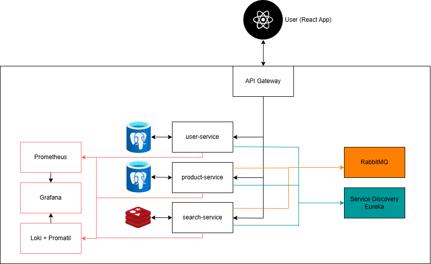

# 🛒 Shoppi – Learning Microservices & React

> 🚧 **Project Status: IN PROGRESS** 🚧
>
> **Progress:** `🟩⬜⬜⬜⬜⬜⬜⬜⬜⬜` **15%**

## 🚀 Project Overview
**Shoppi** is an educational project aimed at learning and implementing **microservices architecture**, **TypeScript**, and **React**. The goal is to build a fully functional **e-commerce platform** inspired by Amazon or Allegro, using modern technologies and best practices.

This project is structured as a **microservices-based system**, where each service is responsible for a different part of the application. The backend is built with **Java (Spring Boot)**, while the frontend is powered by **React + TypeScript**.

---

## 🔥 Core Microservices

| Service Name        | Description | Dev Implemented | Integration Tested |
|---------------------|-------------|------------------|--------------------|
| **User Service**    | Handles user registration, authentication (JWT), and profile management. | ✅ | ❌ |
| **Product Service** | Allows users to create, edit, and delete product listings with categories and images. | ✅ | ❌ |
| **Search Service**  | Provides **full-text search** for product listings using **Redis**. | ⏳ | ❌ |
| **Image Service**   | Stores and serves product/user images uploaded to the platform. | ❌ | ❌ |
| **Order Service**   | Manages customer orders, order history, and purchase tracking. | ❌ | ❌ |
| **Payment Service** | Handles virtual balance, internal transactions (no real payment integration). | ❌ | ❌ |
| **Notification Service** | Sends real-time notifications via **WebSocket/email**. | ❌ | ❌ |

### ⚡ Additional Components
| Component | Description |
|-----------|-------------|
| **API Gateway**  | Built with **Spring Cloud Gateway**, acting as a single entry point for all requests. |
| **Service Discovery**  | Uses **Eureka** to dynamically register and discover microservices. |
| **Asynchronous Messaging**  | **RabbitMQ** enables event-driven architecture for better decoupling of services. |

---

## 🏗️ Current Architecture

Below is the current architecture of the project:



---

## 🛠️ Tech Stack

### **Backend (Microservices)**
- **Java 17** + **Spring Boot**
- **Spring Cloud Gateway** (API Gateway)
- **Eureka** (Service Discovery)
- **RabbitMQ** (Event-driven communication)
- **PostgreSQL** (Primary database)
- **Redis** (Caching & full-text search for Search Service)
- **JWT Authentication** (Custom auth library)
- **Feign Client** (Inter-service communication)
- **Lombok** (For cleaner code)

### **Frontend**
- **React 18** + **TypeScript**
- **React Router** (Client-side navigation)
- **Axios** (API calls)
- **React Query** (Data fetching & caching)
- **Tailwind CSS** (Modern UI styling)

### **Monitoring & Observability**
- **Grafana + Prometheus** (Metrics visualization)
- **Loki** (Centralized logging)
- **Zipkin** (Distributed tracing for tracking requests between microservices)

---

## ⚙️ Database & Search

- **Each microservice has its own PostgreSQL database** (No shared database approach).
- **Full-text search** is implemented using **Redis**, enabling **fast and scalable searching**.

---

## 🏠 Deployment & Orchestration

- **Local Development:** Docker Compose (all microservices & dependencies are containerized).
- **Future Scope:** Kubernetes (potential learning goal for advanced deployment strategies).

---

## 🎯 Learning Goals
- ✅ Understanding **Microservices Architecture**
- ✅ Building scalable **Spring Boot-based microservices**
- ✅ Implementing **JWT authentication** and role-based access control
- ✅ Learning **React + TypeScript** for frontend development
- ✅ Using **RabbitMQ** for event-driven communication
- ✅ Implementing **monitoring & observability** with Grafana, Prometheus, and Zipkin
- ✅ Managing containerized environments using **Docker & Kubernetes (future scope)**

---

## 🚀 Running the Project

### 1️⃣ **Configure Environment Variables**
Before running the project, set up the required environment variables. See [Environment Setup](docs/EnvironmentSetup.md) for details.

### 2️⃣ **Start Backend Services**
```sh
docker-compose up -d
```

### 3️⃣ **Run Frontend Application**
```sh
cd shoppi-web
npm install
npm start
```

---

## 👨‍💻 Author
Created by **Filip Mróz** – Learning **Microservices, TypeScript, and React** 🚀

---
